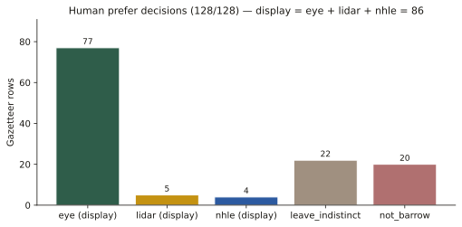
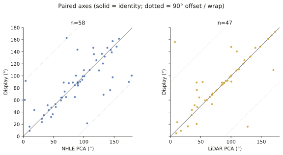

# Wiltshire long-barrow long axes: a human-curated sample, ridges, and the solar overlay

Tim Daw · [sarsen.org](https://www.sarsen.org/) · 8 September 2026

Technical companion to the short note [*Do Wiltshire’s long barrows face the sun?*](wiltshire-long-barrows-facing-the-land.html). The interactive gazetteer is separate: [timdaw37.github.io/wiltshire-long-barrows](https://timdaw37.github.io/wiltshire-long-barrows/). This note is the orientation analysis only.

---

Wiltshire’s long barrows have been claimed for the sun, the moon, and the lie of the land. The claims are usually stronger than the **axes**. This paper uses a new sample: **86 undirected long axes** from a chip-by-chip review of the Wiltshire gazetteer. NHLE scheduling-polygon PCA and auto LiDAR stay as evidence, not as the analysis set.

**Three results.**

1. **The axes are not a solar design.** Midsummer sunrise is indistinguishable from chance. Scoring the *nearest* of midsummer and midwinter looks tight until chance is given the same two targets.
2. **They are not just built along ridges either.** A local DTM plane (mound excluded) puts axes closer to the contour than chance (median mismatch 30° against 45°), but half the sample is still more than 30° off the ground.
3. **Where Historic England has already published a compass class, the eye sample agrees.** After one aerial correction (Amesbury 140), 12 of 13 overlapping Stonehenge-WHS sites sit in the same quadrant as Roberts *et al.* (*Internet Archaeology* 47).

The pooled 86 are consistent with uniformity (Rayleigh *p* = 0.088). A weak east–west excess survives among HER-certain rows only. That is not a solstice, and it is not a tight cluster.

*Figure 1. The 86 display axes, each drawn both ways. Dashed lines are flat-horizon sunrise at about 51.2°N: midsummer ~50°, equinox ~90°, midwinter ~129°. Descriptive overlays, not a claim of intent.*

## 1. Why a new set of axes

Public axes in this gazetteer began as **NHLE scheduling-polygon PCA** (`azimuth_deg`). A scheduling outline is not the mound crest. It can pick up access land, twin mounds, tracks, or a near-orthogonal side of the polygon. Whitebarrow is the textbook case: NHLE ~4°, LiDAR mound ~92°.

A parallel **LiDAR** pipeline (EA Composite DTM 1 m chip → local-relief mound mask → PCA) writes `azimuth_lidar_*` and refuses scores below about 0.40. That still follows plough, dual mounds, and noise.

The **display** axis (`azimuth_display_deg`) is the human prefer decision: eye, lidar, or nhle, promoted without destroying NHLE. Rows marked `not_barrow` or `leave_indistinct` have no display axis and no NHLE fallback on the map.

Convention: image top = north, +x = east. Azimuth **undirected**, folded to **0–180°**. Front or façade end is not asserted. A later light inventory + eye review of labelled / broader ends (Sep 2026) is summarised as a hedged aside in [facing-the-land](wiltshire-long-barrows-facing-the-land.html#which-end-is-the-front) — not folded into the undirected statistics here. For Cotswold–Severn sites the façade is not the mound long axis (Darvill 2004; Corcoran 1969). This paper measures the mound axis only.

`MODERN_ALL_CANNINGS` is excluded as a Neolithic azimuth.

## 2. Sample

Gazetteer **n = 129** (128 Wheatley/HER/NHLE seed rows plus the Cuckoo Stone long barrow, added 8 September 2026). Prefer on the 129:

| prefer | n | In this paper’s axis sample? |
|--------|---|------------------------------|
| eye | 77 | yes |
| lidar | 5 | yes |
| nhle | 4 | yes |
| leave_indistinct | 23 | **no** |
| not_barrow | 20 | **no** |
| **display** | **86** | |

`not_barrow` means the chip does not show a usable long-barrow axis. It is not a verdict on the HER record. `leave_indistinct` means the mound is too weak to measure.

Display split: 75 HER certain, 11 possible; 80 earthen, 6 Cotswold–Severn (Millbarrow indistinct). Clusters among the 86: Stonehenge / Salisbury Plain 35, Wiltshire chalk 19, Avebury / Pewsey 13, North Wiltshire chalk 12, South Wiltshire / Chase fringe 7.

*Figure 2. Prefer decisions on the original 128. Display = eye + lidar + nhle. Cuckoo Stone (`SU14SW521`) is a later 129th row, also `leave_indistinct`.*

### Cuckoo Stone long barrow (`SU14SW521`)

Roberts *et al.* DUR76 / Grinsell Durrington 76 / **NHLE 1009130**, “Long barrow 450 m WSW of Woodhenge”, NGR **SU 14652 43241**. Levelled; published class **NE–SW**; 40 × 28 m from the 1990 parchmark survey. Adjacent to the Cuckoo Stone sarsen, not the same monument.

It is **not** Wheatley seed `SU14SW10W` (South of Fargo Road), which sits 393 m south. A 1 m chip was fetched. Auto PCA 54.1° (conf 0.317) is below the refuse floor. **Eye review of the chip sees nothing usable.** Prefer stays `leave_indistinct`. It is **not** in the 86. Published NE–SW remains on the record; it is not treated as a measured axis here.

## 3. Methods

**Statistics.** Undirected axes are axial data. Angles in [0, 180) are doubled before circular summaries. Reported: axial mean and mean resultant length \(\bar{R}\) of doubled angles; Rayleigh test (Mardia–Jupp *p*); V-test toward specified directions as a descriptive check; bootstrap 95% intervals (10 000 resamples, seed 20260908). If bootstrap spread of the mean covers ≥ 90° of the axial circle, the mean is unidentified. Histograms use 10° and 15° bins. Pairwise undirected difference: \(|\Delta| = \min(|a-b|,\,180-|a-b|)\). Naive means of degrees are not used.

**Solar overlays.** Geometric sunrise at 51.2°N, true solar, no refraction, no local horizon. Values as on the map (`generate.py`): midsummer 50.2°, equinox 89.7°, midwinter 129.0°. On an undirected 0–180° axis, midsummer sunrise is the same line as midwinter sunset. An east–west peak is not a unique solar event.

**Ridge test.** For each of the 86: 1.2 km EA Composite DTM chip at ~10 m; plane fit on an annulus **60–350 m** from the point (mound excluded). Ridge/contour = downslope + 90°, folded 0–180°. Chance median mismatch to one random undirected axis is 45°. Chance median to the *nearest* of the two solstice directions is about 22°.

**Literature axes.** Roberts *et al.* 2018 Table 1 (CC BY) compass classes, matched on SMR / OSGB. Agreement = display within 22.5° of the class midpoint.

Re-run (does not write NHLE fields): `python scripts/orientation_analysis.py` then `python scripts/orientation_robust.py`.

## 4. Atlas check: eye versus published SWHS classes

Roberts *et al.* reviewed 21 long and oval barrows in the Stonehenge WHS and environs with earthwork and geophysics plans. That is the right comparison: surveyors, not scheduling polygons.

*Figure 3. Display azimuth against Roberts class midpoint. Green band = same quadrant. After Amesbury 140: 12 agree, 1 look, 0 disagree.*

**Where both measured the same mound, we agree.** Winterbourne Stoke 1 (35°, their NE–SW), Amesbury 42, Amesbury 140 (**157.5°**, their NNW–SSE, from aerials — LiDAR was unclear), Knighton Down, Figheldean 31, Netheravon Bake, Wilsford 13, 30 and 34, Winterbourne Stoke Down, Netheravon 6, Figheldean 27.

Lake Group (`SU14SW133`, WIL41) is **111°** against their NW–SE (midpoint 135°, Δ 24°). Re-looked; **kept**.

Amesbury 140 was the one real dispute over an axis. First eye on the chip was 91° (E–W). Aerial cropmarks are NNW–SSE. HER MWI12478: probable Neolithic long barrow, parallel ditches about 20 m long and 12 m apart. Display is now 157.5°. That correction also removes a false east–west point from a *possible* row, which is why the pooled Rayleigh test moved (section 6).

### In the gazetteer, no axis

HER (and in several cases excavation) treats these as long barrows. The chips are too weak. They stay as points.

| Roberts | Gazetteer | Record |
|---------|-----------|--------|
| AM14 | `SU14SW127` | NHLE **1008953** long barrow, NNW–SSE, mound to 1.8 m |
| WS86 | `MWI75694` | Levelled long barrow (2015–16 confirmation) |
| WOO2 | `SU13NW151` | Excavated (Vatchers 1963 / Harding and Gingell 1986). Prefer `leave_indistinct`, not `not_barrow` |
| AM7 / AM10a | `SU14SW105` | Oval / dubious long (Field *et al.* 2014) |
| DUR76 | `SU14SW521` | **Cuckoo Stone long barrow**, NHLE 1009130. Eye: indistinct. Chip and published NE–SW on file; no display |

### WS71 and the bowl-barrow scheduling

`SU14SW997` is in the list because HER **MWI13159 / SU14SW997** is titled Neolithic long barrow (Roberts WS71; excavated 2015–16; NE–SW; unscheduled as a long barrow).

The **same NGR** is **NHLE 1011046**: “Bowl barrow 400 m south east of Longbarrow Cross Roads” (1995; 26 m diameter). The gazetteer attached a **circular scheduling polygon** (29.6 × 29.6 m, PCA 63.1°) to a long-barrow HER row. That PCA is not a long-barrow axis and is not used as display. Prefer `leave_indistinct`.

## 5. Ridges versus solstices

Peer consensus for Wiltshire chalk is no clear common astronomical alignment; topography matters (Ruggles 1997, 1999; Roberts *et al.* 2018, §5.5; Darvill 1997, 178; McOmish *et al.* 2002). Field (2006, 69) floated midsummer sunrise for Winterbourne Stoke 1 and noted the coincidence with the ridge. Burl’s 1987 lunar-arc claim is contested by Ruggles.

*Figure 4. Mismatch of each display axis to three hypotheses. Dotted = chance. Right-hand panel: chance is allowed both solstice targets.*

| Hypothesis | Median \|Δ\| | Chance median | Within 15° (chance) |
|------------|--------------|---------------|---------------------|
| Local ridge | **30°** | 45° | 27% (17%) |
| Ridge, slope ≥ 1° (n=57) | **26°** | 45° | 33% (17%) |
| Midsummer sunrise ~50° | 40° | 45° | 16% (17%) |
| Nearest of the two solstices | 21° | **22°** | 30% (33%) |
| Equinox ~90° | 37° | 45° | 26% (17%) |

Ridge-following is real and modest. Axes prefer the contour to the fall line (only 12 of 86 within 22.5° of downslope). They are not a ridge atlas.

Solstice is not an effect. Midsummer hits 15° as often as a random direction. Nearest-of-two is the fair null for “some solstice”; the data do not beat it.

*Figure 5. Display against local ridge. Darker points = steeper plane. A ridge-built sample would hug the diagonal.*

Winterbourne Stoke 1 (`SU14SW125`): display **35°**, Roberts NE–SW, Field’s midsummer ~50°. Agreement with the surveyors. The 60–350 m plane is almost flat (slope 0.3°) and comes out at 50° — Field’s coincidence, not a forced choice.

West Kennet (`SU16NW100`, 84.5°) **sits on a spur** of the Kennet downs; its long axis follows the nose of that spur (east–west), with the river valley under the north flank. A sceptic who says it runs along the ridge is right at valley scale. East Kennet (`SU16NW101`, 139°) sits on the same high ground **below the crest** of a NE-facing slope (NHLE 1012323: NW–SE); its long axis is **across the ridge**, not along it — see `fig-16-kennet-pair`. The 60–350 m plane fails both celebrity mounds, in opposite directions: West Kennet mismatch 74° (westward rise onto the downs dominates a two-sided ridge); East Kennet mismatch 7° (plane strike ~132° follows the scarp, not the E–W watershed). Believe the contours, not the screen, for named topography. Two neighbours, two recipes; the 86 as a set still only modestly follow local tilt.

## 6. The 86 after Amesbury 140

Moving Amesbury 140 from a LiDAR-guessed 91° to aerial NNW–SSE 157.5° takes a spurious east–west point out of a possible cropmark. Pooled Rayleigh *p* moves from 0.046 to **0.088**.

| | n | \(\bar{R}\) | Rayleigh *p* |
|--|--:|------------:|-------------:|
| All display | 86 | 0.17 | **0.088** |
| Earthen only | 80 | 0.14 | 0.20 |
| HER certain only | 75 | 0.21 | 0.031 |
| Stonehenge / Salisbury Plain | 35 | 0.15 | 0.46 |
| Cotswold–Severn | 6 | 0.73 | 0.034 |

The pooled sample is consistent with uniformity. Earthen majority likewise. HER-certain still shows a **weak east–west excess** (*p* = 0.031): not a solstice, and not tight (bootstrap mean CI still ~47° wide). Cotswold–Severn n=6 is too small; four of the six sit near E–W as mound long axes, not as façades.

*Figure 6. 10° bins, n=86. Peak 90–100° (10; uniform expectation 4.8). Spread, not a design.*

Axial mean 86.9° (bootstrap 95% CI 59–117°). Display tracks LiDAR (median \|Δ\| 2.2°, n=47) more closely than NHLE (6.6°, n=58). NHLE still produces near-orthogonal footprint failures. That is why the chips were reviewed.

*Figure 7. Paired axes. Solid = identity; dotted = 90° offset. NHLE has more orthogonal outliers than LiDAR.*

## 7. Caveats

- Undirected axes. Midsummer sunrise ≡ midwinter sunset after the 0–180 fold.
- Ridge is a local plane, not a named spur and not a viewshed. Scale matters (WS1).
- No topographic horizon, no refraction, no woodland model.
- Eye overlay is a chip reading; Amesbury 140 is an aerial class midpoint (157.5°).
- Cuckoo Stone: published NE–SW is a record class, not an eye measurement.
- Roberts classes are 45° buckets.
- Ashbee, Kinnes 1992, and McOmish *et al.* 2002 SPTA tables were not ingested as numbers.
- No intent claims.

## 8. Data

Display sample: `scripts/orientation_batch_out/analysis/display_sample.csv`.  
Roberts match: `roberts_match.csv`. Ridge table: `ridge_vs_axis.csv`.  
Figures: `docs/analysis/fig-01` … `fig-14` (SVG and PNG).

Map bot owns `data/long_barrows.json`, `index.html`, and push. Analysis scripts are read-only on NHLE `azimuth_deg`.

Compilation © Tim Daw / sarsen.org · CC BY-SA 4.0.  
NHLE © Historic England / OGL. EA LiDAR © Environment Agency / OGL.  
Roberts *et al.* 2018 Table 1 / Figure 14 © the authors / *Internet Archaeology*, CC BY.  
Zenodo Wheatley recreation 10.5281/zenodo.11005373; Kutty 2024 10.5281/zenodo.10989406.

### Sources used (not invented)

- Roberts, D. *et al.* 2018. *Internet Archaeology* 47. https://doi.org/10.11141/ia.47.7
- Ruggles 1997 (PBA *Astronomy and Stonehenge*); Ruggles 1999, 126–127
- Darvill 1997, 178; Darvill 2004; Corcoran 1969; Field 2006, 69
- McOmish, Field and Brown 2002; Bowden *et al.* 2015; Bax *et al.* 2010
- Burl 1987 — contested (Ruggles)
- Harding and Gingell 1986 (Woodford 2)
- Wiltshire HER MWI12478, MWI12487, MWI13159, MWI75694, MWI10607
- NHLE 1008953 (long barrow); 1009130 (Cuckoo Stone long barrow); 1011046 (bowl barrow at the WS71 HER NGR)
- Historic England NHLE; Environment Agency Composite DTM 1 m
