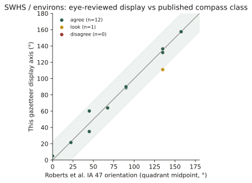
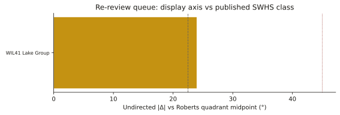
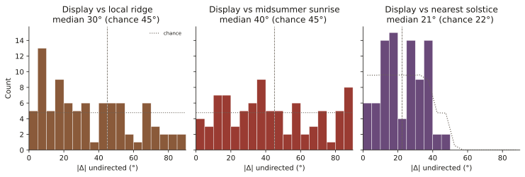

# Wiltshire long barrows: ridges, not solstices

Tim Daw / [sarsen.org](https://www.sarsen.org/). Data freeze 2026-09-08 (map rebuilt after aerial re-reading of Amesbury 140).

I have a human-reviewed long-axis for **86** of **128** Wiltshire gazetteer rows, measured on EA 1 m LiDAR chips and, where the chip failed, on aerial cropmarks. The map at `index.html` now serves those display axes.

Two questions, answered first.

**Are they just built along ridges?** Somewhat, not mostly. Against a local DTM plane the axes sit closer to the ridge/contour than chance (median mismatch **30°** against **45°**). Half the sample is still more than 30° off the ground.

**Is there evidence of solstitial alignment?** No. Midsummer sunrise is chance. Scoring the *nearest* of the two solstice axes looks tight until chance is given the same two targets; then it disappears.

A third check, which the map needed: **do the eye axes match people who have surveyed these mounds?** On the Stonehenge WHS set in Roberts *et al.*, *Internet Archaeology* 47, **yes** — 12 of 13 comparable sites sit in the same compass quadrant. The one leftover (Lake Group) I have looked at again and kept.


*Figure 1. Eighty-six undirected display axes, each drawn both ways. Dashed lines: flat-horizon sunrise at ~51.2°N (midsummer ~50°, equinox ~90°, midwinter ~129°). Overlays, not intent.*

## The sample the map uses

| prefer | n | On the map as an axis? |
|--------|---|------------------------|
| eye | 77 | yes |
| lidar | 5 | yes |
| nhle | 4 | yes |
| leave_indistinct | 22 | **no** |
| not_barrow | 20 | **no** |
| **display** | **86** | |

NHLE scheduling-polygon PCA (`azimuth_deg`) was never overwritten. It is evidence in the detail panel, not the icon. Axes are undirected, 0–180° from north. No front end is asserted. Cotswold–Severn façades are a different measurement (Darvill 2004; Corcoran 1969). `MODERN_ALL_CANNINGS` is out.

`not_barrow` means the chip does not show a usable long-barrow axis. It is not a verdict on the HER record. `leave_indistinct` means the mound is too weak to measure.

## 1. The atlas check

Roberts *et al.* 2018 published compass classes for 21 long and oval barrows in the Stonehenge WHS and environs (Table 1, Figure 14; CC BY). I matched their Wiltshire SMR numbers and OSGB points to this gazetteer and compared display azimuth to the **midpoint of their class** (NE–SW = 45°, and so on). A class is a 45° bucket, so agreement within 22.5° of the midpoint is the same quadrant.



*Figure 2. Same mounds, two measurements. Green band = same compass quadrant. After setting Amesbury 140 from aerials: 12 agree, 1 look, 0 disagree.*

**Where both of us measured the same mound, we agree.** Winterbourne Stoke 1 (my 35°, their NE–SW), Amesbury 42, Amesbury 140 (now 157.5°, their NNW–SSE), Knighton Down, Figheldean 31, Netheravon Bake, Wilsford 13, 30 and 34, Winterbourne Stoke Down, Netheravon 6, Figheldean 27.

Lake Group (`SU14SW133`, WIL41) is 111° against their NW–SE (midpoint 135°, Δ 24°) — just outside the quadrant. I have looked at the chip again and kept 111°.



*Figure 3. The only remaining class offset. Confirmed, not a misread.*

### What the map does not draw as an axis

HER confirms these as long barrows. The chips are too weak. They stay in the gazetteer as points.

| Roberts | Gazetteer | HER |
|---------|-----------|-----|
| AM14 | `SU14SW127` North of Normanton Gorse | MWI12487 / NHLE **1008953 long barrow**, NNW–SSE, mound to 1.8 m |
| WS86 | `MWI75694` SE of Longbarrow Crossroads | MWI75694 levelled long barrow (the 2015–16 confirmation) |
| WOO2 | `SU13NW151` NW of Camp Plantation | MWI10607 excavated long barrow (Vatchers 1963). Chip indistinct — not “not a barrow”. |
| AM7 / AM10a | `SU14SW105` West of Stonehenge | Oval / dubious long (Field *et al.* 2014) |

**DUR76** (Cuckoo Stone long barrow) is not this gazetteer. `SU14SW10W` South of Fargo Road is 393 m away.

### WS71 and the bowl barrow

`SU14SW997` SSE of Longbarrow Crossroads is in the list because the HER seed is **SU14SW997 / MWI13159**, which the live HER titles **Neolithic Long Barrow** (Roberts WS71; excavated 2015–16; NE–SW).

The **same NGR** is scheduled as **NHLE 1011046: “Bowl barrow 400m south east of Longbarrow Cross Roads”** (1995; 26 m diameter). The gazetteer therefore attached a **circular scheduling polygon** (29.6 × 29.6 m, PCA 63.1°) to a long-barrow HER row.

That NHLE number is not a long-barrow axis and is not used as display. Prefer stays `leave_indistinct`. The scheduling link stays, with the type clash in the notes. This is why a bowl barrow appeared in a long-barrow list.

## 2. Ridges versus solstices

Literature for this landscape already prefers topography over cosmology: no common astronomical or topographic alignment on the SPTA (McOmish *et al.* 2002; Ruggles 1999, 126–127), and the same in the SWHS (Roberts *et al.* 2018, §5.5; Darvill 1997, 178). Field (2006, 69) floated midsummer sunrise for Winterbourne Stoke 1 and immediately noted the coincidence with the ridge. Burl’s lunar-arc reading is contested by Ruggles (1997).

**Method.** For each of the 86 display sites: 1.2 km EA Composite DTM chip at ~10 m; plane fit on an annulus **60–350 m** from the point (mound excluded). Ridge / contour orientation = downslope + 90°, folded 0–180°.



*Figure 4. Distance from the display axis to three hypotheses. Dotted = chance. The right-hand panel gives chance two solstice targets — the fair test.*

| Hypothesis | Median \|Δ\| | Chance median | Within 15° (chance) |
|------------|--------------|---------------|---------------------|
| Local ridge | **30°** | 45° | 27% (17%) |
| Ridge, slope ≥ 1° (n=57) | **26°** | 45° | 33% (17%) |
| Midsummer sunrise ~50° | 40° | 45° | 16% (17%) |
| Nearest of the two solstices | 21° | **22°** | 30% (33%) |
| Equinox ~90° | 37° | 45° | 26% (17%) |

Ridge-following is real and modest. Axes prefer the contour to the fall line (only 12 of 86 within 22.5° of downslope). They are not a ridge atlas.

Solstice is not an effect. Midsummer hits 15° exactly as often as a random direction. The nearest-solstice trick is what the right-hand panel is for.


*Figure 5. Display axis against local ridge. Darker = steeper plane. A ridge-built sample would hug the diagonal.*

Winterbourne Stoke 1 (`SU14SW125`): display **35°**, Roberts NE–SW, Field’s midsummer ~50°. We agree with the surveyors. The 60–350 m plane here is almost flat (slope 0.3°) and comes out at 50° — Field’s coincidence, at a scale that is not the long cemetery ridge. West Kennet (84.5°) sits **across** a well-defined local slope (mismatch 74°).

## 3. The 86, after the aerial correction

Correcting Amesbury 140 from a LiDAR-guessed 91° to aerial NNW–SSE **157.5°** took a spurious east–west point out of a *possible* cropmark. That is enough to move the pooled test.

| | n | \(\bar{R}\) | Rayleigh *p* |
|--|--:|------------:|-------------:|
| All display | 86 | 0.17 | **0.088** |
| Earthen only | 80 | 0.14 | 0.20 |
| HER certain only | 75 | 0.21 | 0.031 |
| Stonehenge / Salisbury Plain | 35 | 0.15 | 0.46 |
| Cotswold–Severn | 6 | 0.73 | 0.034 |

The pooled sample is **consistent with uniformity**. Earthen majority likewise. HER-certain still shows a **weak east–west excess** (*p* = 0.031) — not a solstice, and not a tight cluster (mean CI still ~47° wide). Cotswold–Severn n=6 is too small; four of the six sit near E–W, which is the long-axis of those mounds, not a façade claim.


*Figure 6. 10° bins, n=86. Peak still 90–100° (10; uniform expectation 4.8). Spread, not a design.*

Axial mean 86.9° (bootstrap 95% CI 59–117°). Display tracks LiDAR (median \|Δ\| 2.2°, n=47) more closely than NHLE (6.6°, n=58). NHLE still produces near-orthogonal footprint failures (Whitebarrow 87.7°). That is why the chips were reviewed.

## Caveats

- Undirected axes. Midsummer sunrise is the same line as midwinter sunset after the 0–180 fold.
- Ridge here is a local plane, not a named spur and not a viewshed.
- No topographic horizon, no refraction, no woodland.
- Eye overlay is a chip reading; AM140 is an aerial class midpoint (157.5°), labelled as such.
- Roberts classes are 45° buckets.
- Ashbee / Kinnes / McOmish SPTA tables were not ingested as numbers.
- No intent claims.

## The map

`python generate.py` writes `index.html` from `data/long_barrows.json`. Current build: **128 barrows, 86 display axes**. Serve that folder. Icons, filters and the primary detail value use `azimuth_display_deg` only — no NHLE fallback when prefer is `not_barrow` or `leave_indistinct`.

```
python scripts/orientation_analysis.py
python scripts/orientation_robust.py
python generate.py
```

Gazetteer JSON is not written by the analysis scripts. Landscape DTM chips cache under `lidar/landscape/` (TIFFs gitignored). Tables: `scripts/orientation_batch_out/analysis/`.

Compilation © Tim Daw / sarsen.org · CC BY-SA 4.0.  
NHLE © Historic England / OGL. EA LiDAR © Environment Agency / OGL.  
Roberts *et al.* 2018 Table 1 / Figure 14 © the authors / *Internet Archaeology*, CC BY.  
Zenodo Wheatley recreation 10.5281/zenodo.11005373; Kutty 2024 10.5281/zenodo.10989406.

### Sources used

- Roberts, D. *et al.* 2018. *Internet Archaeology* 47. https://doi.org/10.11141/ia.47.7
- Ruggles 1997 (PBA *Astronomy and Stonehenge*); Ruggles 1999, 126–127
- Darvill 1997, 178; Darvill 2004; Corcoran 1969; Field 2006, 69
- McOmish, Field and Brown 2002; Bowden *et al.* 2015; Bax *et al.* 2010
- Burl 1987 — contested (Ruggles)
- Harding and Gingell 1986 (Woodford 2)
- Wiltshire HER MWI12478, MWI12487, MWI13159, MWI75694, MWI10607
- NHLE 1008953 (long barrow); NHLE 1011046 (bowl barrow, same NGR as WS71 HER)
- Historic England NHLE; Environment Agency Composite DTM 1 m
