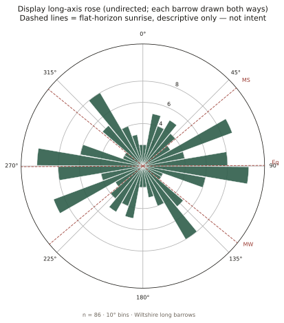
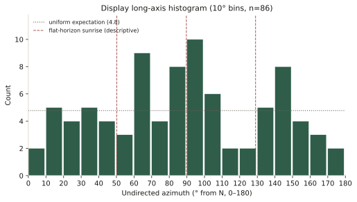
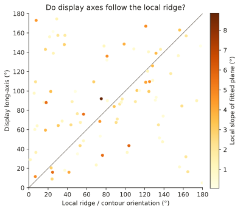
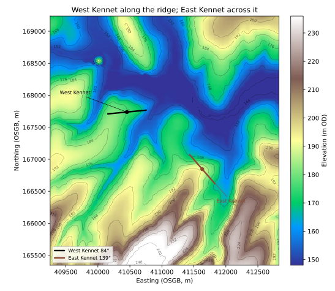

# Do Wiltshire’s long barrows face the sun?

Tim Daw · [sarsen.org](https://www.sarsen.org/) · September 2026

The short answer is **no** — not as a shared design, and not as folklore likes. They do not all run along the ridges either. What they do, mostly, is spread.

Every arrow is on the map:

**[The Wiltshire Long Barrow Gazetteer](https://timdaw37.github.io/wiltshire-long-barrows/)**

What follows is the evidence behind those arrows.

---

## Standing on other people’s work

None of this starts from a blank field.

Clive Ruggles insisted that prehistoric “astronomy” has to survive a proper test, not a pretty sunrise. His reading of the Wiltshire chalk — and his demolition of Aubrey Burl’s lunar-arc claim for Salisbury Plain long barrows — remains the honest baseline: **no clear common celestial alignment**, and the land matters.

David Field, David McOmish and Graham Brown, walking the Salisbury Plain Training Area, said the same in plainer boots: long barrows sit with care in local ground, without a single shared bearing.

Around Stonehenge, Historic England’s landscape surveys — Bax, Bowden, Soutar, Field, Barber and colleagues — drew the mounds that are actually there, not the scheduling polygons. Dave Roberts and co-authors then put twenty-one of those WHS long barrows into *Internet Archaeology* 47: plans, dates, and a calm conclusion that **local topography is the key to alignment**, with a note that the more easterly end of many mounds seems to have mattered. They published the table.

Timothy Darvill, Corcoran, Ashbee, Kinnes, Piggott: the catalogues and the Cotswold–Severn distinction. Environment Agency LiDAR, Historic England’s NHLE, the Wiltshire HER extracts that David Wheatley’s Zenodo recreation opened for reuse. We add a county-wide, chip-checked set of axes on top of that work, not instead of it.

If this note is useful, it is because those people already did the hard looking.

---

## What was measured

A long barrow has a long **axis**: the line of the mound, not the way a façade or forecourt “faces”. That line has two ends. We treat it as **undirected** — a bearing between 0° and 180° from north. Midsummer sunrise and midwinter sunset are the same line once you fold the compass that way. That alone should slow anyone down before saying “it faces the solstice”.

Historic England’s scheduling polygons give a first-pass axis, but the outline of a scheduled plot is not the crest of the mound. Environment Agency 1 m LiDAR can see the earthwork when it survives. Neither is gospel. Each of 128 Wiltshire gazetteer chips was reviewed by eye (a 129th row, the ploughed-out Cuckoo Stone long barrow by Woodhenge, was added from the records; **nothing usable shows on the chip**, so it has no arrow).

**Eighty-six mounds** have a trusted long axis. Forty-three do not: too faint, ploughed out, or not a long-barrow axis on the chip. Famous names sit in that second group — Fussell’s Lodge, Amesbury 14, Winterbourne Stoke 71, the Cuckoo Stone long barrow — which is a result, not a slight. If you cannot see the mound, you should not invent its bearing.

Those 86 arrows are what the [map](https://timdaw37.github.io/wiltshire-long-barrows/) draws.

*Figure 1. Eighty-six Wiltshire long-barrow axes, each drawn both ways. The dashed lines are sunrise on a flat horizon at this latitude: midsummer, equinox, midwinter. They are drawn so you can see them. They are not a finding.*

---

## What the 86 actually do

They **spread**.

There is a gentle pile-up near east–west. There is not a spike at midsummer (~50°) or midwinter (~129°). A proper circular test on undirected data does not reject a uniform scatter for the full sample. Restrict the set to the 80 earthen (Wessex) mounds and the scatter is even more ordinary. The seven peer-cited Cotswold–Severn chambered long barrows in the county are too few to carry a solar argument; several simply run roughly east–west — the mound, not the forecourt.

Around Stonehenge itself — the group Roberts and Historic England know best — there is **no preferred bearing**. That matches what they already said.

A weak east–west hint remains among HER-certain sites only. It is not a solstice, and it is not a tight cluster. It is the smear you would expect if people sometimes built along a down, sometimes across a spur, and often just along the mound they had room to raise.

*Figure 2. The same 86 in ten-degree bins. The dotted line is what an even spread would look like. Midsummer sunrise does not win.*

Score each barrow against *whichever* solstice is closer and the match looks better — until you give a random set of axes the same two targets. Chance is then just as close. That is the whole of the solar result.

---

## Ridges, not a rule

So are they simply laid along the ridges?

We fitted a plane to the Environment Agency terrain in a ring around each mound (close enough to be “here”, far enough out that the barrow itself is not the hill). The long **axes** sit nearer the contour than chance would put them. They prefer the ridge line to the fall line. **They do not glue themselves to the ridge.** Half the sample is still more than thirty degrees off the local ground.

That is the picture Field, McOmish, Ruggles and Roberts described in words: careful siting, no single recipe.

*Figure 3. Each point is one barrow: long axis against a fitted local plane (a blunt screen — see West Kennet below). If every mound followed that plane, the points would sit on the diagonal. They do not.*

Winterbourne Stoke 1, the great mound at Longbarrow Crossroads, is the example Field already flagged. Its axis is about 35°, in the same NE–SW class Historic England surveyed. Midsummer sunrise is about 50°. The ridge of the later round-barrow cemetery runs that way too. Field wrote that the solar match may be coincidence given the topography. A wider look at the DTM says the ground immediately around the mound is almost flat. The land does not force a choice, and we should not pretend it does.

### “But West Kennet runs along the top of a ridge”

It does. Anyone who has stood on the mound knows the Kennet is under the north flank. We are not denying that.

Two different sentences get stuck together here.

**Where it is:** on a spur of the downs, a nose of high ground with the river valley wrapping north and east. That is siting.

**Which way the mound points:** roughly east–west (84.5°), along the local crest of that nose.

East Kennet, a mile to the south-east and the same Cotswold–Severn tradition, is the foil. Historic England’s scheduling puts it **below the crest** of a north-east facing slope, long axis north-west/south-east. The eye on the mound is about 139°. That is **across the ridge** of the same downs, not along it. West Kennet rides the nose of the spur. East Kennet cuts across the high ground. Same tradition, two recipes.

*Figure 4. West Kennet (black) along the ridge; East Kennet (brown) across it. Environment Agency terrain, about four kilometres across.*

So the old description of West Kennet is fair at valley scale. A sceptic who says “it follows the ridge” is looking at the same ground we are. They cannot then say the Kennet long barrows *as a class* follow the ridge: East Kennet is the neighbour that doesn’t.

The county-wide computer test is blunter: the best-fit *tilt* of a ring of ground around each mound, so the barrow itself is not counted as the hill. A ridge falls both ways; the steeper or broader flank wins the plane. At West Kennet that flank is the rise westward onto the downs, so the machine reports the axis as “across the local slope.” At East Kennet the ring is the north-east hillside, so the machine reports the axis as *along* the scarp, not the watershed. Neither report is the named ridge. Believe the contours.

We are confident of this much:

- West Kennet is on a ridge, and its long axis follows the nose of that spur.
- East Kennet is on the same high ground, **below the crest**, and its long axis cuts **across** the ridge.
- Neither is a midsummer alignment (84.5° and 139° are not ~50°).
- Two famous mounds on one down do not make a rule for the other 84. The set as a whole is only modestly closer to local contours than chance, which is why Field, McOmish, Ruggles and Roberts refused a single recipe.

If the computer and the eye disagree on a celebrity barrow, believe the eye and the contours. The statistics are for the crowd.

---

## Agreement with the surveyors

On the Stonehenge World Heritage Site, Historic England and Roberts *et al.* had already classed the long **axes** (NE–SW, W–E, and so on). Where we both measured the same mound, **we land in the same quadrant**. Winterbourne Stoke 1, Amesbury 42, the Wilsford and Figheldean groups, Netheravon Bake: the eye on the LiDAR chip is seeing what the earthwork survey saw.

That is the point of doing the work this way. The new county set is not a rival catalogue. It takes their standard of looking — mound, not paperwork — out across Wiltshire, including the unscheduled and the almost-ploughed.

Scheduling polygons remain on the map as evidence. They are sometimes right, and sometimes nearly at right angles to the earthwork. The arrows ignore those failures.

---

## How to read the map

On the [gazetteer](https://timdaw37.github.io/wiltshire-long-barrows/), gold markers are HER-certain, grey are possible. **Rim arrows mark the long axis where we could see one.** A plain circle means we could not, and we have not borrowed a polygon to fake it.

Filter by earthen versus Cotswold–Severn (seven chambered sites, membership from the published lists only). Zoom in on a desktop and the 1 m LiDAR chip appears. The detail panel still shows the NHLE and auto-LiDAR numbers as witnesses.

If a name you love has no arrow, that is the honest state of the earthwork on the chip.

---

## What we are not saying

We are not saying Neolithic people never watched the sky. We are saying **this set of mound long axes does not show a shared solstitial aim**.

We are not saying topography did not matter. We are saying it mattered **locally and variously**, which is what the people who walked these downs already told us.

We are not measuring façades, forecourts, or “which end is the front”. For a Cotswold–Severn tomb that is a different question, and a different paper.

And we are not done. Ashbee’s and Kinnes’s printed lists, and a true viewshed against a wooded or bare horizon, are still sitting on the shelf. A first cut at skyline-from-below is a companion note: [Do Wiltshire’s long barrows stand on the skyline?](wiltshire-long-barrows-skyline.html). The [map](https://timdaw37.github.io/wiltshire-long-barrows/) will move as the gazetteer does.

---

Figures, tables and the full statistical note live with the technical companion: [wiltshire-long-barrow-orientations.html](wiltshire-long-barrow-orientations.html).

Compilation © Tim Daw / sarsen.org · [CC BY-SA 4.0](https://creativecommons.org/licenses/by-sa/4.0/).  
NHLE © Historic England / OGL · EA LiDAR © Environment Agency / OGL.  
Roberts *et al.* 2018, *Internet Archaeology* 47, CC BY.  
HER seed: Wheatley recreation [10.5281/zenodo.11005373](https://doi.org/10.5281/zenodo.11005373); Kutty 2024 [10.5281/zenodo.10989406](https://doi.org/10.5281/zenodo.10989406).

### With thanks

Ruggles; Field, McOmish and Brown; Roberts, Valdez-Tullett, Last, Oswald, Bowden, Field, Barber, Bax and all the Historic England Stonehenge landscape team; Darvill; Ashbee; Kinnes; the Wiltshire and Swindon HER; Historic England NHLE; Environment Agency LiDAR. The mistakes are ours.
