# Do Wiltshire’s long barrows stand on the skyline?

Tim Daw · [sarsen.org](https://www.sarsen.org/) · September 2026

The short answer is **no** as a shared design — same family as the solar result. Some do (Adam’s Grave class). Many famous ones do not. Being visible on a ridge is not the rule.

Every arrow is on the map:

**[The Wiltshire Long Barrow Gazetteer](https://timdaw37.github.io/wiltshire-long-barrows/)**

What follows is a first cut at a different question from the ridge-axis work: not whether the mound *runs along* high ground, but whether it was meant to *stand on the skyline* from approaches where you can see its length.

---

## Standing on other people’s work

None of this starts from a blank field.

David Field and David McOmish, walking the chalk, kept saying the same thing in different words: long barrows sit with care in local ground; there is no single shared recipe. Clive Ruggles insisted prehistoric “display” claims have to survive a proper test, not a pretty photograph. Dave Roberts and colleagues, around Stonehenge, put local topography first and published the table. David Wheatley’s HER recreation and the Environment Agency county DTM are what let a county-scale check exist at all.

We add a systematic skyline-from-below sample on top of that work, not instead of it. If this note is useful, it is because those people already did the hard looking.

---

## Two sentences that get stuck together

People say long barrows “sit on the ridge” and mean two different things.

One is **siting**: the mound is on high ground. West Kennet is. Many others are. That is true and not the test here. The companion note already showed that long *axes* sit nearer the contour than chance, without gluing themselves to it. East Kennet, a mile from West Kennet and the same Cotswold–Severn tradition, cuts **across** the ridge. Same downs, two recipes.

The other is **design as a skyline marker** — a landscape controller — from approaches where the **length** of the mound shows: broadside views, not end-on. Does the crest sit against sky, silhouetted, from those wedges? Or is it only visible *against* rising ground beyond?

That is the question I wanted answered. “Along the ridge” was the wrong sentence.

Two photographs show the phenomenon the maps are trying to score. They are ground truth for those viewpoints. They are not a county rule.

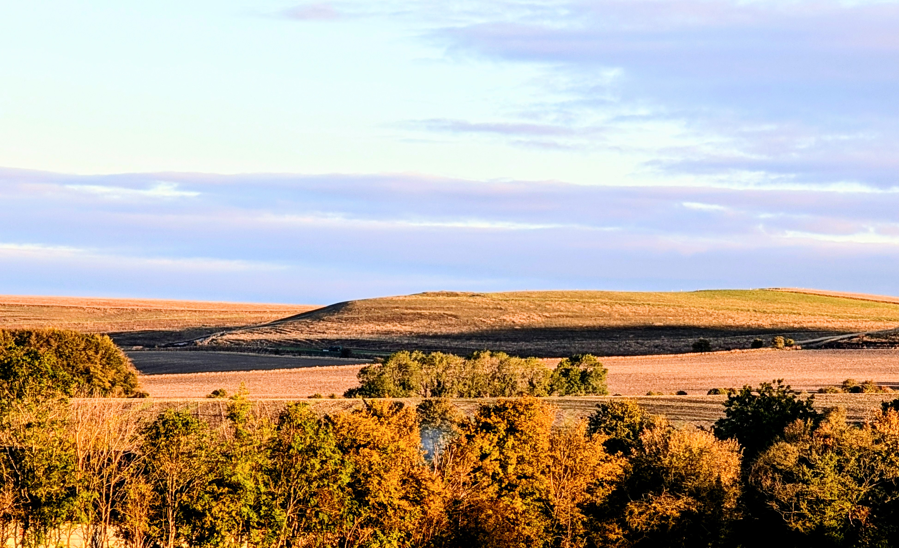

*Figure 1. Kitchen Barrow from a lower southern approach, 9 September 2026. The mound is the bump on the distant ridge, silhouetted against sky. That is a skyline-from-below catch.*

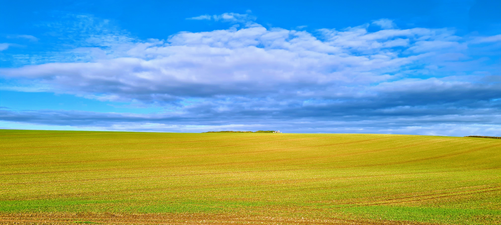

*Figure 2. West Kennet from the north, 22 October 2021. The long mound sits on the ridge skyline; people on the crest give the scale. Shared album: [photos.app.goo.gl/CTFFnN9gZJKQZBWU6](https://photos.app.goo.gl/CTFFnN9gZJKQZBWU6).*

Kitchen’s southern silhouette is what an Adam’s-class neighbour looks like in a photograph: a distant ridge bump, length showing, sky behind it. West Kennet from the north *can* do the same. The rest of this note asks whether those catches are typical of the defined approaches, or rare sweet spots.

---

## What was measured

Take each barrow’s trusted long **axis** (the undirected bearing already on the [gazetteer](https://timdaw37.github.io/wiltshire-long-barrows/)).

From that axis, open two **perpendicular wedges** — the bearings where the length is visible, about ±32° either side of broadside. Inside those wedges only, drop observers on a dense grid at road-to-ridge scale (roughly 0.3–2.5 km). For each cell, ask whether a line of sight to the crest is clear on the county Environment Agency DTM, **and** whether ground beyond the crest rises above that line. If it does not, the mound is the local horizon peak: **skyline from below**.

Maps are contour fields of that clearance, not a single corridor percentage. Green (positive clearance) means the crest sits above the far horizon. Red means you can often still *see* the mound, but against higher chalk beyond. Percentages are a blunt summary of the green.

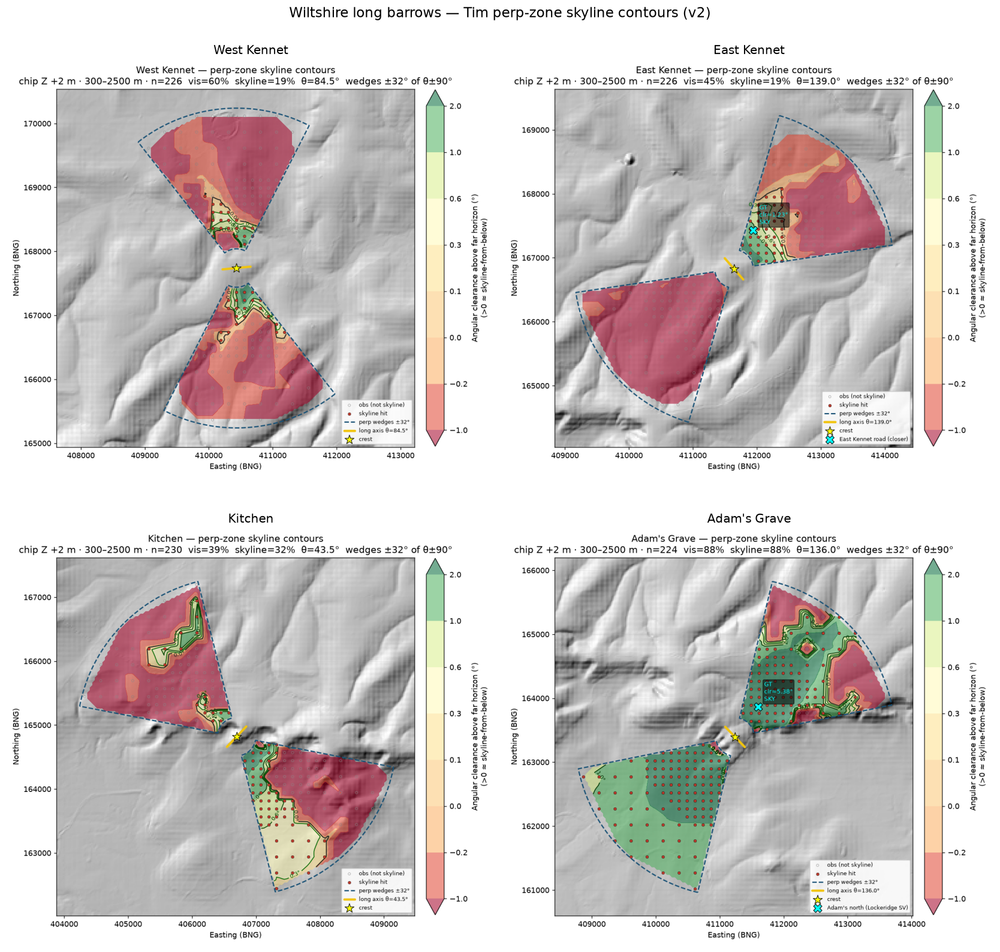

*Figure 3. The local four on the same frame. Blue dashed wedges are the length-shows approaches; yellow tick is the long axis; red dots are skyline hits. Green is silhouette; red is crest against rising far ground. Adam’s Grave is almost all green. Kitchen has a coherent southern catchment. West and East Kennet are mostly red, with small green pockets near the mound.*

Ground truth before the computer: Kitchen’s southern silhouette (Figure 1); West Kennet from the north (Figure 2); Adam’s Grave from the Lockeridge approach; East Kennet from the nearer road. Pins and photos check that the model can catch real views when they exist.

Crest height is the 1 m LiDAR chip plus a modest reconstruction stick-up of 2 m. Eye height is standing height (1.7 m). Mild earth curvature and refraction are on. Contour-band nulls — random points on the same height band — are secondary. Named barrows should beat them if “designed skyline marker” is the claim.

This is **not** a ridge-axis test, **not** a Tilley-style walk, and **not** the Bulford solstitial horizon-altitude protocol. Do not mix the three.

---

## The local four

Adam’s Grave, Kitchen, West Kennet, East Kennet. Same stretch of down. Same method.

### Adam’s Grave

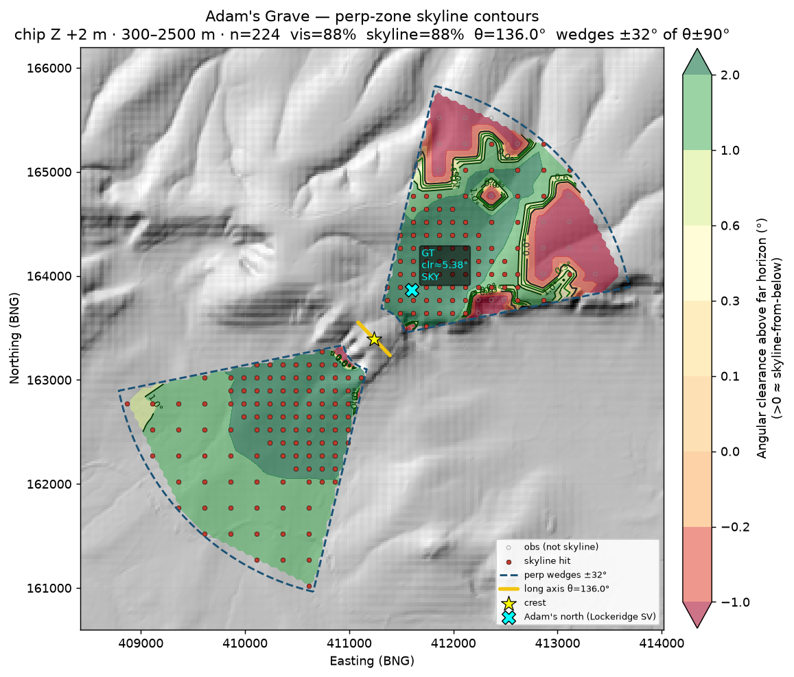

*Figure 4. Adam’s Grave. About 88% of the broadside sample puts the mound on the skyline. The cyan X is the Lockeridge pin (~593 m north of the crest): clearance ≈ +5.4°. That is what an Adam’s-class silhouette looks like in these scores.*

From Pewsey Vale to the south, and from the Lockeridge approach to the north, the scarp-edge mound is almost always the horizon peak when it is visible at all. Contour-band nulls average ~14%. A fake crest shoved 200 m downslope, in the earlier corridor run, collapsed to 0%. The Lockeridge pin sits squarely in the green.

### Kitchen

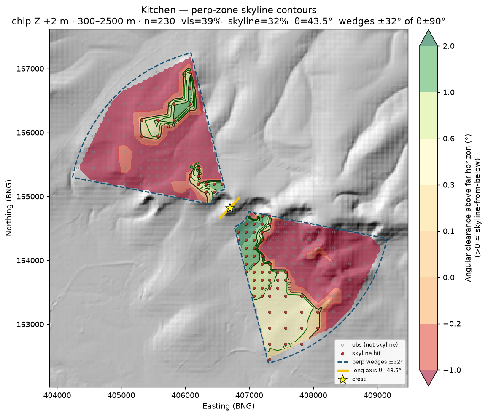

*Figure 5. Kitchen Barrow. About 32% skyline in the same frame, beating local nulls (~8%) by roughly four times. The southern wedge is the catchment that matches Figure 1.*

Kitchen lands lower than Adam’s Grave but still real. The map shows a coherent southern / vale catchment and a thinner northern one. That is the photograph: a distant ridge bump from below, length showing. Not as dominant as Adam’s Grave. The named site outperforms random same-height ground.

### West Kennet

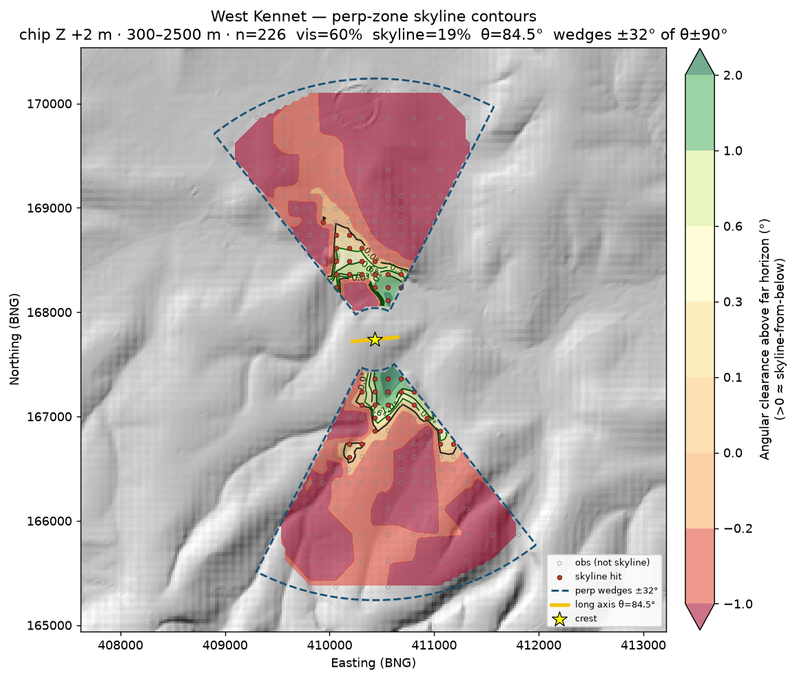

*Figure 6. West Kennet. About 60% of the broadside cells can see the mound; only 19% put it on the skyline. Median clearance is slightly negative. The green pockets sit close in, north and south of the crest. Most of both wedges are red: the ray through the mound continues onto higher chalk beyond.*

West Kennet is the awkward one relative to reputation, and relative to Figure 2.

Corridor-style sampling — vale cells 1–5 km out, not restricted to broadside — made it look almost absent as a true skyline peak (~1%). Restricting to length-shows wedges at nearer range improves it to ~19%, and beats the local contour null (~6%). So there *are* pockets of silhouette, including from the north. Figure 2 is real. The model finds them.

Typical cells in the defined approaches still see the mound against higher chalk beyond more often than against sky. Geometry says why: from much of the northern Kennet valley the ray through West Kennet continues onto the East Kennet ridge and related ground. Raising the target (a taller reconstructed mound) barely moved the corridor skyline percentage. WK *can* silhouette from the north. As a *fraction of the defined approaches* it is not Adam’s Grave.

### East Kennet

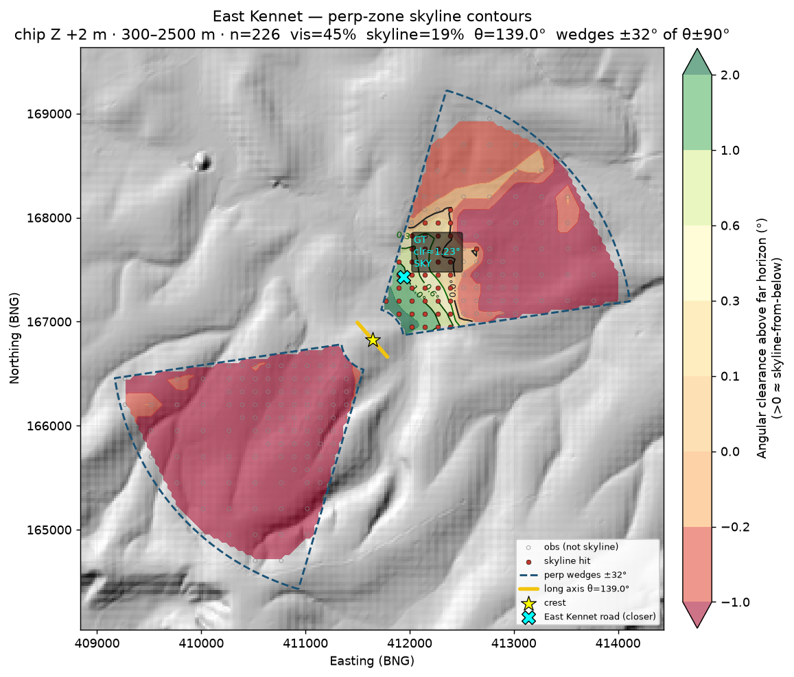

*Figure 7. East Kennet. About 19% skyline, similar to its neighbour. The cyan X is the nearer road pin (~678 m north-east of the crest): clearance ≈ +1.2°, a genuine high-contour catch. The south-west wedge is almost entirely red.*

East Kennet’s road pin sits in a coherent positive-clearance pocket on the north-east side. The earlier sample was too far; at ~0.7 km the mound *does* silhouette broadside. That does not make the rest of the approach an Adam’s-class catchment. Most of the south-west wedge sees the crest against rising far ground.

So: two strong local markers, two famous neighbours that do not carry the same score. Same downs, different recipes — again.

| Site | Axis | n | % visible | % skyline | Median clr | vs null |
|------|-----:|--:|----------:|----------:|-----------:|--------:|
| **Adam’s Grave** | 136.0° | 224 | 87.5 | **87.5** | +2.66° | 6.1× |
| **Kitchen** | 43.5° | 230 | 39.1 | **31.7** | +0.59° | 3.9× |
| West Kennet | 84.5° | 226 | 59.7 | 19.0 | −0.29° | 3.1× |
| East Kennet | 139.0° | 226 | 44.7 | 18.6 | −0.13° | 2.4× |

---

## Ten more, same test

Archivist / Tim-flagged prominent and good-survival sites, same perp-wedge method: Winterbourne Stoke Crossroads (WS1), Whitebarrow, Giants Grave, Cold Kitchen Hill, Tinhead Hill, South Street, Horton Down, Lanhill, King Barrow, Amesbury 42. (Cold Kitchen Hill is **not** Kitchen.)

### Winterbourne Stoke 1

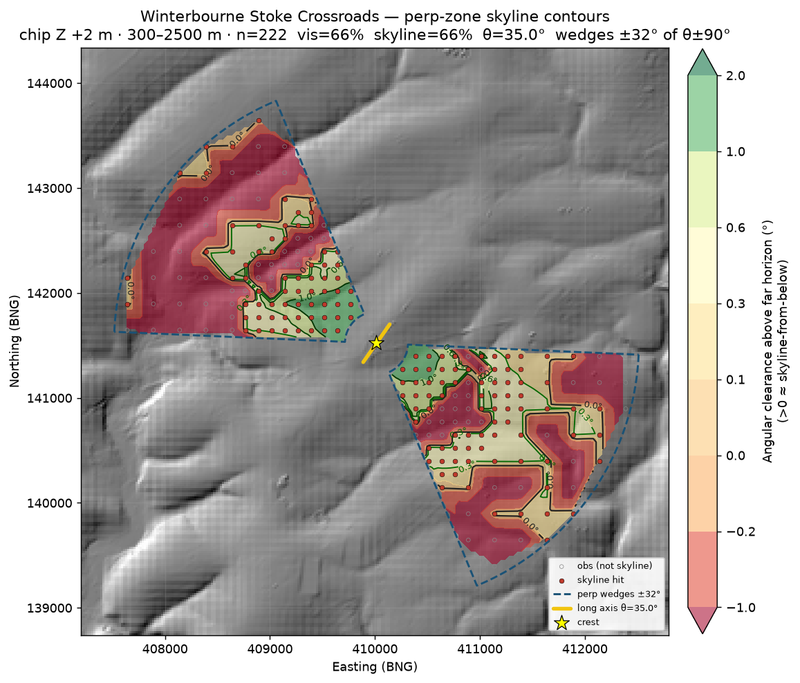

*Figure 8. Winterbourne Stoke 1, the great surviving mound at Longbarrow Crossroads. About 66% skyline — every visible cell in this sample is also a skyline hit. Median clearance +0.53°. The ratio versus null is only 2.6× because ridge nulls on this ground are high (~25%). Still the standout of the second batch.*

WS1 is the pilot-2 headline. Field already flagged the mound as a topographic object first. The skyline maps agree: from the length-shows wedges at road-to-ridge scale, it behaves like an Adam’s-class catchment, not a solar instrument and not a coincidence of a pretty photograph.

### The rest of the ten

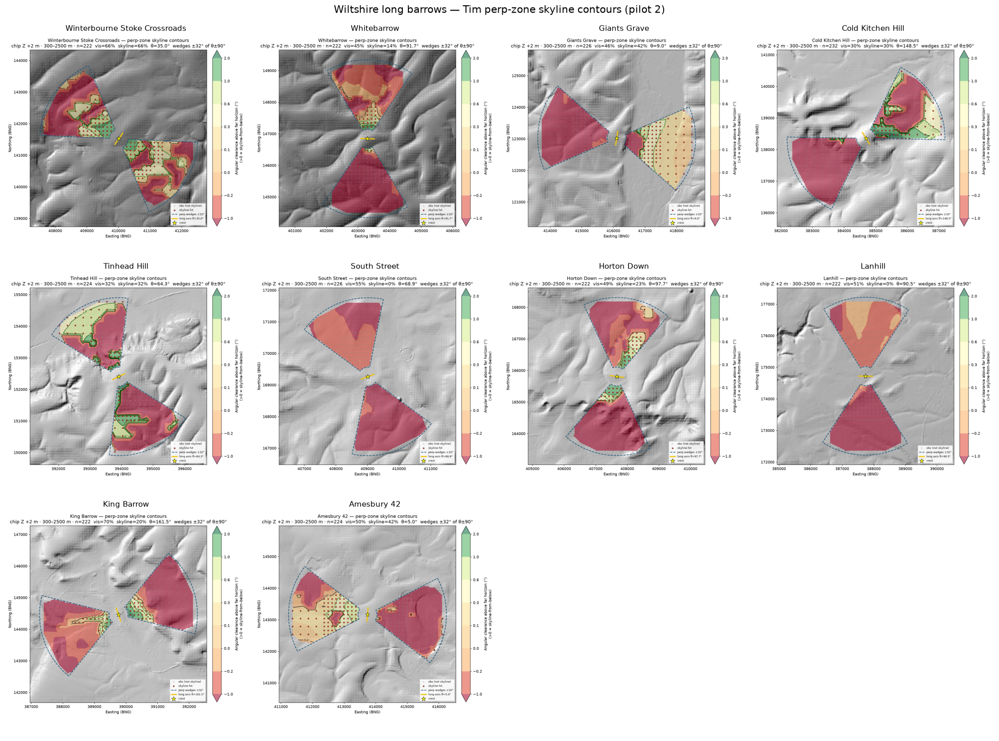

*Figure 9. Ten prominent / good-survival mounds on the same frame as Figure 3. Green catchments at WS1, Giants Grave, Amesbury 42, Cold Kitchen Hill and Tinhead Hill. South Street and Lanhill are dark red throughout.*

**Giants Grave** and **Amesbury 42** sit in a second tier near **42%** skyline, both with slightly positive median clearance.

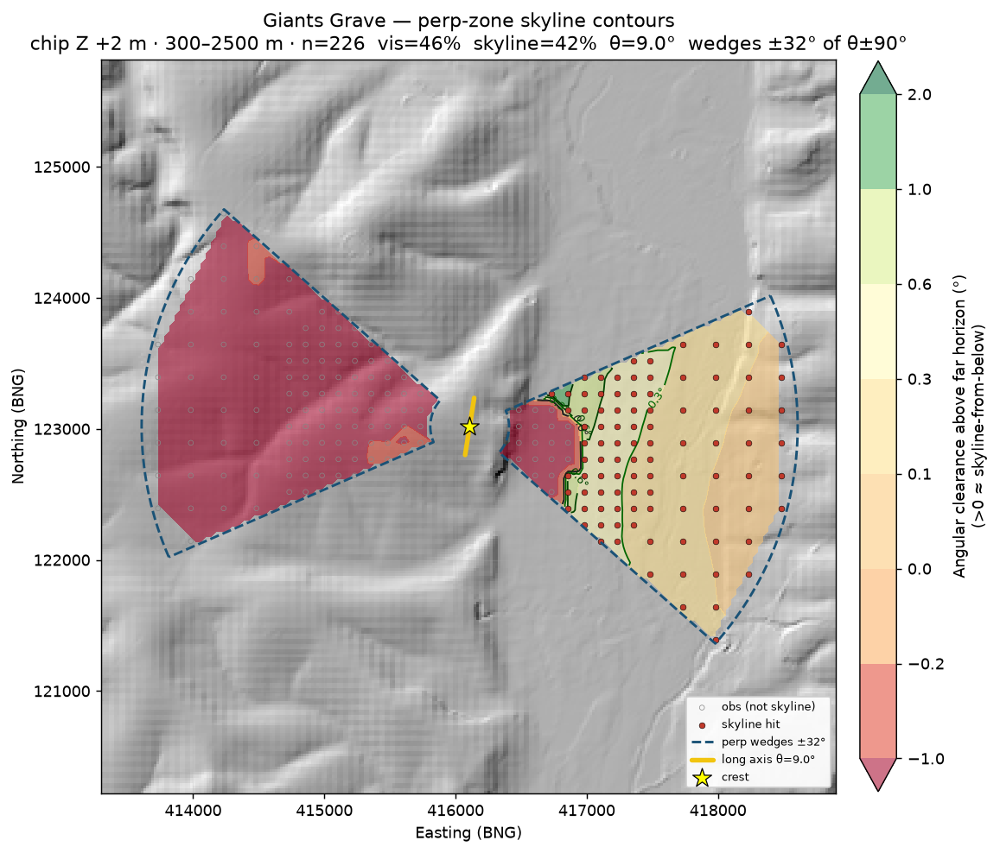

*Figure 10. Giants Grave, above the Wylye. One wedge is a coherent skyline catchment; the other is almost empty. About 42% skyline overall — Kitchen-class coverage, strongly one-sided.*

**Cold Kitchen Hill** and **Tinhead Hill** land around **30%**, Kitchen-class coverage with the strongest positive clearance cores in the batch (about +1.2° and +1.1°). Cold Kitchen Hill is a separate monument from Kitchen; it happens to score in the same band.

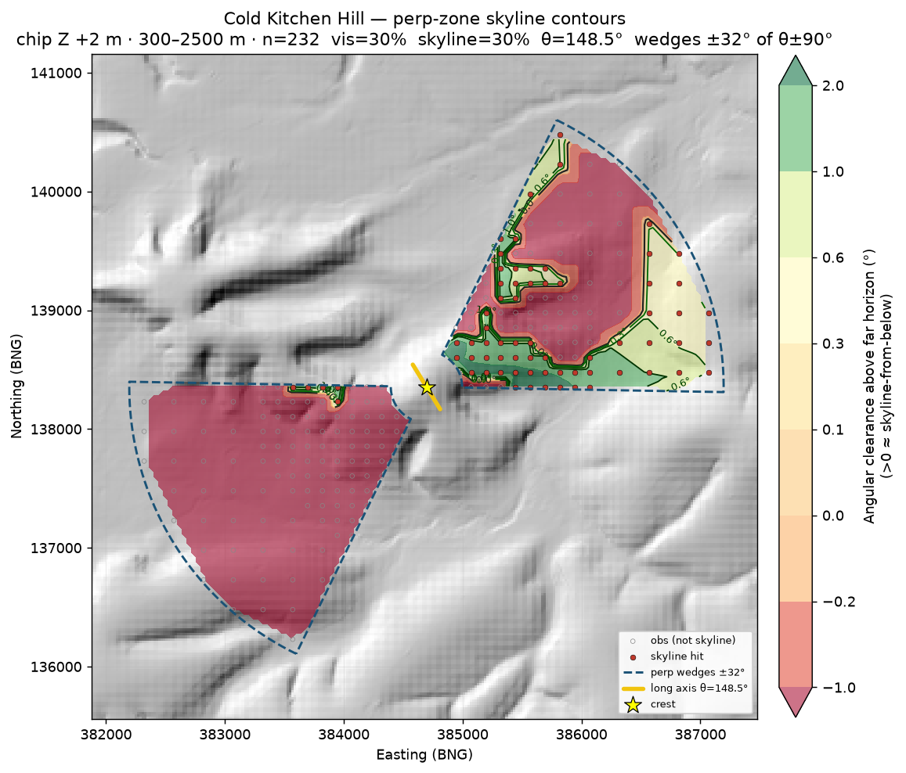

*Figure 11. Cold Kitchen Hill (ST83NW101), not Kitchen. About 30% skyline; median clearance +1.21°, the strongest angular core in this batch. The north-east wedge carries the catchment; the south-west wedge does not.*

**Horton Down** and **King Barrow** beat their local nulls but are weaker in absolute skyline cover (~23% and ~20%).

**Whitebarrow** is often visible and rarely the true crest-against-sky silhouette (~14%).

### The fails

Survival and fame are not the same as skyline design.

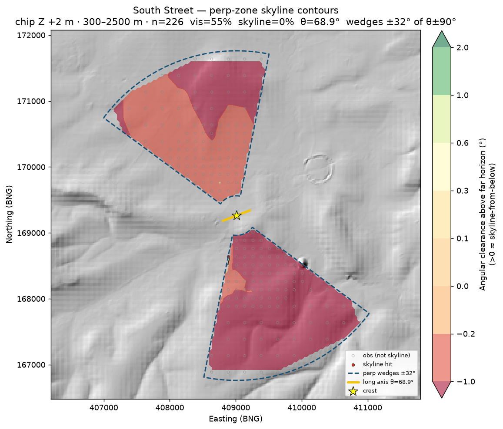

*Figure 12. South Street. About 55% of the broadside sample can see the mound. Skyline hits: 0.4%. Median clearance −0.53°. The crest sits against rising far ground from almost every length-shows cell.*

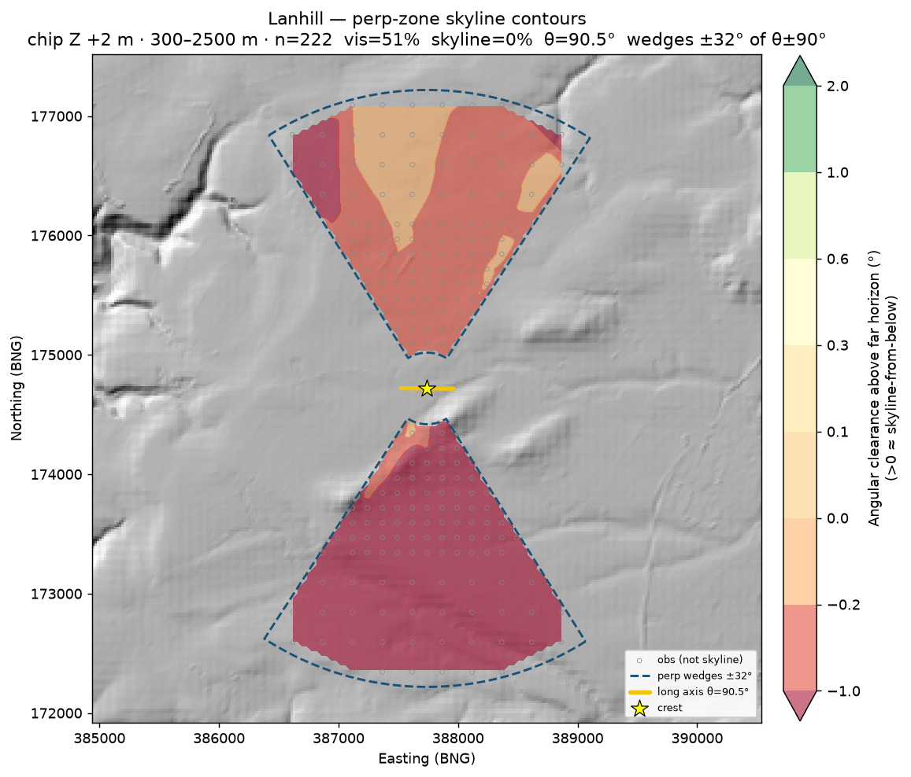

*Figure 13. Lanhill. About 51% visible; 0% skyline. A well-known surviving mound, length showing from the sides, never the local horizon peak in this frame.*

South Street sits in the Avebury landscape, a short walk from West Kennet. Lanhill is a Cotswold–Severn chambered long barrow with a good earthwork. Neither behaves as a skyline marker from the approaches where the length shows. That is the point of doing the work this way: the method that lights up Adam’s Grave leaves these two dark.

| Site | Axis | % visible | % skyline | Median clr | vs null |
|------|-----:|----------:|----------:|-----------:|--------:|
| **Winterbourne Stoke 1** | 35.0° | 66.2 | **66.2** | +0.53° | 2.6× |
| Amesbury 42 | 5.0° | 50.5 | **42.4** | +0.24° | 1.9× |
| Giants Grave | 9.0° | 46.5 | **42.0** | +0.25° | 2.2× |
| Tinhead Hill | 64.3° | 31.7 | **31.7** | +1.05° | 1.4× |
| Cold Kitchen Hill | 148.5° | 29.7 | **29.7** | +1.21° | 1.9× |
| Horton Down | 97.7° | 48.7 | 23.4 | −0.14° | 3.9× |
| King Barrow | 161.5° | 69.8 | 19.8 | −0.51° | 3.6× |
| Whitebarrow | 91.7° | 44.6 | 14.4 | −0.14° | 2.0× |
| South Street | 68.9° | 55.3 | 0.4 | −0.53° | 0.2× |
| Lanhill | 90.5° | 51.4 | **0.0** | −0.29° | 0.0× |

---

## Combined ranking (blunt)

Fourteen mounds. Rank by skyline fraction in the length-shows wedges. Numbers will move if the distance band, wedge width or vegetation model moves. The **rank order** is what I trust for now.

| Class | Sites (approx. % skyline) |
|-------|---------------------------|
| **Strong** | Adam’s Grave (~88%); WS1 (~66%); Giants Grave / Amesbury 42 (~42%); Kitchen (~32%); Cold Kitchen / Tinhead (~30%) |
| **Mid** | Horton Down (~23%); King Barrow / West Kennet / East Kennet (~19–20%); Whitebarrow (~14%) |
| **Fail** | South Street (~0%); Lanhill (0%) |

A few mounds behave like length-on-skyline markers. A larger set of well-known names do not. West and East Kennet sit in the middle once you stop scoring them as corridor percentages and stop cherry-picking the sweet-spot photograph. The photograph remains true. It is not typical.

---

## What that means

Visible on the ridge, like sunrise alignment, **does not seem to be a factor** — not a shared design rule for Wiltshire’s long barrows.

Local effects exist. Adam’s Grave and WS1 are not accidents in these maps. Kitchen, Giants Grave, Amesbury 42, Cold Kitchen and Tinhead show real catchments. That is careful siting and, in places, effective display.

There is **no county recipe**. The same method that lights up Adam’s Grave leaves South Street and Lanhill dark as silhouettes, and leaves West and East Kennet looking ordinary once you stop at the viewpoint that makes the postcard. Field, McOmish, Ruggles and Roberts already told us to expect local topography without a single bearing or a single display trick. The skyline scores say the same in a different dialect.

The two photographs at the top of this note are doing honest work. Figure 1 is what Kitchen’s southern catchment looks like from a real vale. Figure 2 is what West Kennet’s northern pocket looks like on a clear October afternoon. The maps are there so that neither picture has to carry a theory by itself.

---

## Caveats (keep these next to the maps)

- **Bare-earth DTM** — Environment Agency terrain without trees. Real woodland on approaches or crests would shrink catchments. Treat percentages as an upper bound.
- **Trees and chalk brightness** — a fresh chalk mound would have been a louder signal than a green DTM bump; vegetation would have muffled it. Neither is modelled.
- **Chronology** — Neolithic land cover and original mound height are not in the machine.
- **Nulls** — raw skyline % on chalk scarps can flatter any high point. Contour-band and downslope checks matter when claiming “designed marker.”
- **Approach definition** — results are conditional on the perp wedges and the 0.3–2.5 km band. A different sampling frame changes the percentages; the photo and pin ground truths remain valid for their viewpoints.
- **20 m county DTM** — fine for vale→ridge lines of sight; crest detail comes from the 1 m chips. Coarse cells near the crest can smear local ridge texture.
- This is **not** a ridge-axis test and **not** a solstitial horizon-altitude protocol. Do not mix the three.

---

## What we are not saying

We are not saying no long barrow was ever seen on a skyline. Some clearly were, and still are. Figures 1 and 2 are two of them.

We are not saying topography did not matter. We are saying skyline *display from length-shows approaches* mattered **locally and variously**, when it mattered at all.

We are not done. A larger Wiltshire batch, DSM / vegetation sensitivity, and denser observers near the photo azimuths are still sitting on the shelf. The [map](https://timdaw37.github.io/wiltshire-long-barrows/) will move as the gazetteer does.

---

Technical notes (pilot methods):

- Pilot 1 (corridor framing): [wiltshire-long-barrows-skyline-pilot.md](wiltshire-long-barrows-skyline-pilot.md)
- Pilot 1 refreshed (perp-zone contours, local four): [wiltshire-long-barrows-skyline-pilot-v2.md](wiltshire-long-barrows-skyline-pilot-v2.md)
- Pilot 2 (Tim-flagged ten): [wiltshire-long-barrows-skyline-pilot-2.md](wiltshire-long-barrows-skyline-pilot-2.md)

Contour maps used in the note live under [`assets/`](assets/). Larger GIS exports stay local under `analysis/skyline_pilot*` until a later push.

Orientation / ridge companion: [Do Wiltshire’s long barrows face the sun?](wiltshire-long-barrows-facing-the-land.html) · [technical note](wiltshire-long-barrow-orientations.html). Hillforts comparison: [Do Wiltshire hillforts avoid long barrows?](https://timdaw37.github.io/wiltshire-hillforts-long-barrows/).

Compilation © Tim Daw / sarsen.org · [CC BY-SA 4.0](https://creativecommons.org/licenses/by-sa/4.0/).  
Photographs © Tim Daw.  
NHLE © Historic England / OGL · EA LiDAR © Environment Agency / OGL.  
Roberts *et al.* 2018, *Internet Archaeology* 47, CC BY.  
HER seed: Wheatley recreation [10.5281/zenodo.11005373](https://doi.org/10.5281/zenodo.11005373).

### With thanks

Field, McOmish and Brown; Ruggles; Roberts and the Historic England Stonehenge landscape team; Wheatley; the Wiltshire and Swindon HER; Historic England NHLE; Environment Agency LiDAR. The mistakes are ours.
